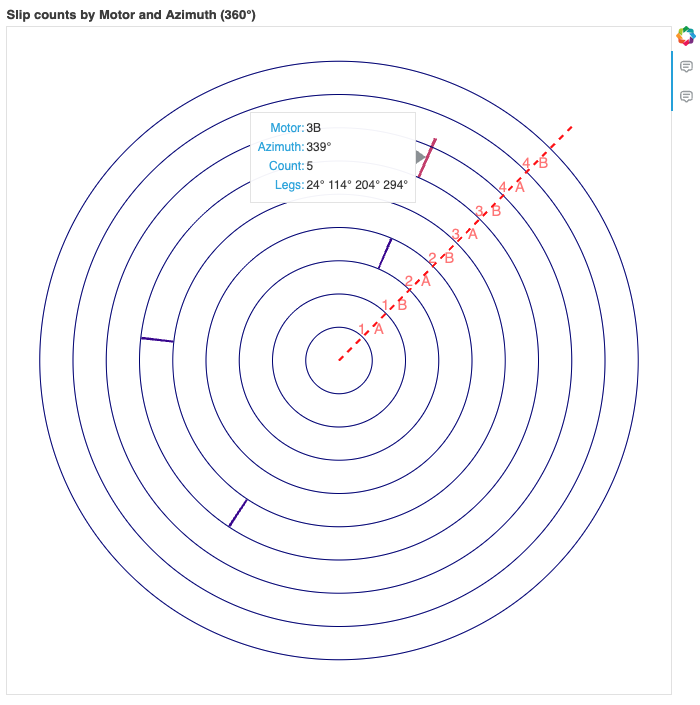

# controls-notebooks
---

This is a collection of Jupyter notebooks maintained by the controls software team.  The intended audience are users inside the Keck organization, using a Windows virutal machine.  Installation for use within a Linux VM is left to the reader.

Reports
: slip_report/slip_report.ipynb - creates a chart showing where the telescope is encountering slip faults.  

## Prerequisites

Install these applications on your VM.

#### Anaconda Python
tbd

#### GitHub Desktop
tbd